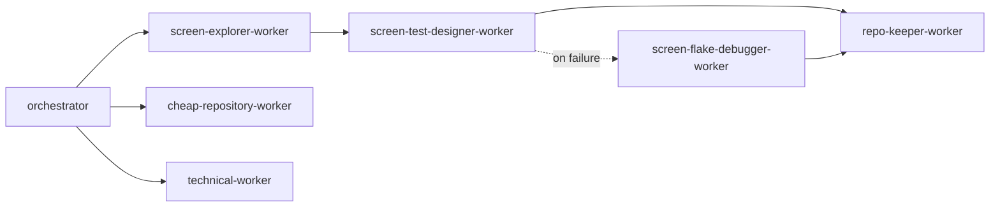

# Copilot custom agents — `multilanetesting`

Two layers:

- **`orchestrator.agent.md`** — the user-facing entrypoint. Routes a task to the lightest path and
  delegates to the hidden workers. Wraps the `orchestrate` skill.
- **`*-worker.agent.md`** — hidden workers (`user-invocable: false`), one per Claude specialist agent.
  Each is a ~15-line wrapper that defers to its Claude source of truth in `.claude/agents/`.

| Worker | Wraps (`.claude/agents/`) | Role |
|---|---|---|
| `cheap-repository-worker` | (native Copilot worker) | Low-cost read-only repo/doc/config audits |
| `technical-worker` | (native Copilot worker) | Low-cost technical code/test/automation tasks |
| `screen-explorer-worker` | `screen-explorer.md` | Discover + freeze locators |
| `screen-test-designer-worker` | `screen-test-designer.md` | Author deterministic specs |
| `screen-flake-debugger-worker` | `screen-flake-debugger.md` | Fix drift/flake |
| `repo-keeper-worker` | `repo-keeper.md` | Validate + memory sync |

Handoff flow:

Invocation policy is canonical in [`AGENTS.md`](../../AGENTS.md) → "Skill and agent invocation".
When changing a worker's behavior, edit the Claude body it wraps — the wrapper picks it up.
