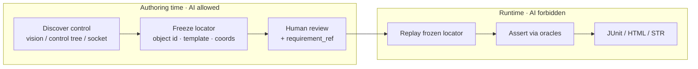
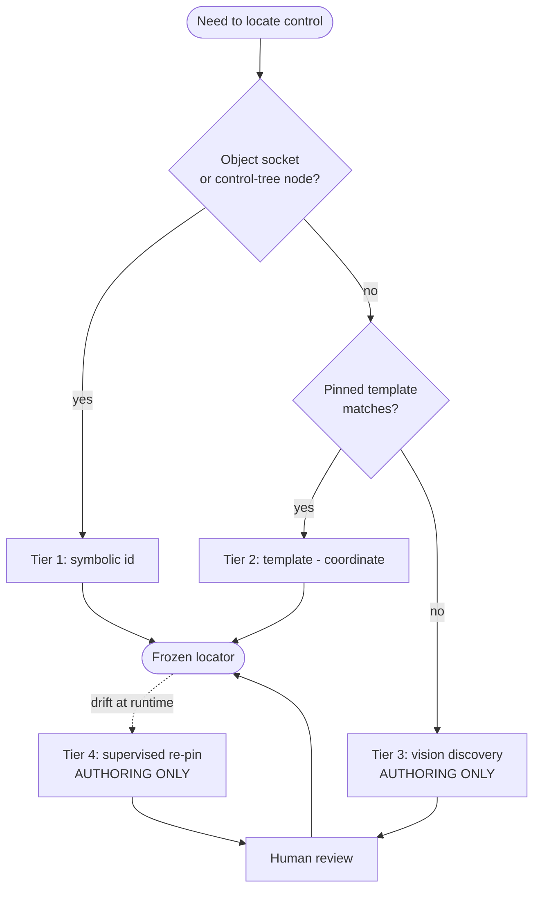
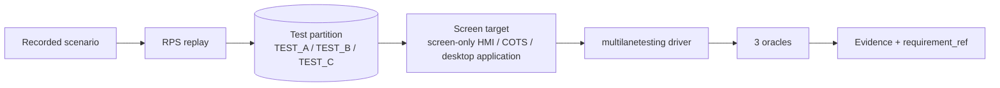

# Architecture — `multilanetesting`

End-to-end verification framework for **any multi-surface system under test**, covering all testable surfaces:

| Lane | Surface | When to use |
|---|---|---|
| **Web / DOM** | Browser UI with a queryable DOM | System exposes an Angular/web UI |
| **API contract** | REST/HTTP endpoints | System exposes a JSON/HTTP API |
| **WS contract** | STOMP/WebSocket messages | System emits or accepts WS/STOMP frames |
| **Screen driver** | Framebuffer over VNC/RDP, C++ HMI, COTS | No DOM — screen-only target |

Build only the lanes the target system actually exposes. The screen driver is the novel lane;
Playwright, API contract, and WS contract follow the same conventions proven in mature Playwright DOM suites.

This document defines the screen-driver model (driver tiers, oracles, deterministic world) that
does not exist in the other lanes. For the other lanes, see the path-scoped instruction files in
`.github/instructions/`. The [`IMPLEMENTATION_PLAN.md`](IMPLEMENTATION_PLAN.md) turns everything
into phased work.

---

## 1. The core principle: AI at authoring, not at runtime



- **Authoring** may use vision models and computer-use to *discover* a control and *generate* a
  stable locator. This is a one-time, human-reviewed step.
- **Runtime** replays the frozen locator with **no model in the loop**. Runs are deterministic,
  reproducible, cheap, and CI-safe. This single rule kills the three things that make AI-driven UI
  testing unusable in regulated QA: non-determinism, per-run cost, and unauditable behaviour.

---

## 2. Driver tiers (locator strategies, in priority order)

A locator is resolved by the **highest-confidence tier available** for the target. Lower tiers are
fallbacks, not equals.

| Tier | Strategy | Mechanism | Determinism | Use |
|---|---|---|---|---|
| **1 — Object introspection** | Query the app's own object model | App inspection socket (e.g. the screen-only HMI C++ object/label channel — DOM-equivalent) **or** native UI automation/control tree (Windows UIA/FlaUI, Linux AT-SPI, Java Access Bridge) | Highest — symbolic ids | **Preferred** wherever a socket or control tree exists |
| **2 — Image template** | Match a pinned reference image | OpenCV / SikuliX template match → coordinate | High, but pixel-bound | When no object model is reachable |
| **3 — Vision (authoring only)** | Discover/generate a Tier-1/2 locator | Local CV (OpenCV region proposals) + offline OCR (PaddleOCR/EasyOCR) proposes the locator to *freeze* | Authoring-only — never at runtime | First-time discovery, new screens |
| **4 — Supervised heal** | Re-pin a drifted locator | AI proposes a new freeze for **human approval** | Authoring-only, gated | When a frozen locator stops resolving |

**Resolution order:** Tier 1 → Tier 2 at runtime. Tiers 3 and 4 only run during authoring/healing,
always behind human review.



---

## 3. The three oracles (how we decide pass/fail)

A test asserts against one or more oracles. They form a hierarchy of truth.

| Oracle | Question it answers | Source | Authority |
|---|---|---|---|
| **Functional truth** | Did the system actually do the right thing? | App object/state socket (e.g. screen-only HMI C++ channel) | **The gate** — authoritative pass/fail |
| **Rendering truth** | Did it draw the right thing? | Golden-image diff (Playwright `toHaveScreenshot`, BackstopJS) | Visual regression |
| **Legibility truth** | Can a human read it? | Offline OCR (Tesseract / PaddleOCR) | Text-presence / readability |

**Rule:** functional truth is the gate. Rendering and legibility truth are corroborating evidence,
never a substitute for the functional oracle when a functional channel exists.

---

## 4. Deterministic world (replay, never live)

Screen tests are only reproducible if the *inputs* are reproducible. We never test against live
operational data.

- **Replay engine:** a record-and-playback system (**RPS**) replays a recorded scenario into
  a **test partition** (e.g. `TEST_A` / `TEST_B` / `TEST_C`). **Never `PROD`.**
- **Scenario = fixture:** a frozen RPS scenario is the screen-lane equivalent of a Playwright
  fixture. Same scenario in → same pixels/objects out.
- **Harness reuse:** where the target system already has a functional-test harness or a
  record-and-playback facility, reuse its introspection socket and scenario metadata instead of
  building a parallel channel. Keep the harness-specific wiring in your estate repo, not in the
  engine.



---

## 5. Building blocks (mostly OSS)

| Concern | Options | Notes |
|---|---|---|
| Object introspection (Tier 1) | App inspection socket / MapGrab-style bridge | Preferred; symbolic ids |
| Native UI automation trees (Tier 1) | FlaUI / pywinauto (Win UIA), AT-SPI (Linux), Appium, Java Access Bridge | Native automation/control-tree access |
| Scenario replay | RPS (record-and-playback system) | Test partitions only |
| Input synthesis | PyAutoGUI | Keyboard/mouse at coordinates |
| Image match (Tier 2) | OpenCV, SikuliX, Eggplant | Eggplant commercial |
| Golden image (rendering oracle) | Playwright `toHaveScreenshot`, BackstopJS, Applitools | Applitools commercial/AI |
| OCR (legibility oracle) | Tesseract 5, PaddleOCR, EasyOCR | **Offline** — no cloud |
| Vision discovery (Tier 3, authoring) | OpenCV region proposals + offline OCR (PaddleOCR/EasyOCR, Apache-2.0) | All offline, no external service; no licence risk |
| Computer-use (Tier 3/4, authoring) | n/a — dropped (external screenshot egress prohibited) | Replaced by local CV + OCR discovery |
| Display / isolation | Xvfb + Docker, VNC/RDP | Isolated VM, no secrets to model |
| Evidence | HTML / JUnit / JSON + requirements system / Jira / test-report adapters | Every run emits JUnit + HTML with a `requirement_ref` for traceability |

---

## 6. The other lanes (web, API, WS)

These lanes are **first-class**, not optional plugins. What they share with the screen-driver lane
is the *discipline*: env-gated activation, no host literals, user-intent test naming, evidence
output, and traceability. The screen-only rules (frozen locators, tier ladder, partition refusal,
golden-image/OCR oracles) do **not** apply here — the web lane keeps standard Playwright
conventions, and the API/WS lanes are passive contract checks. Build whichever lanes the target
system exposes.

| Lane | Workspace | Env gate | Key tool | Conventions |
|---|---|---|---|---|
| **Web / DOM** | `tests/web/` | always on | Playwright | Selector factory (`selectors/<area>.ts`), `test.step()` user-intent naming, web-first assertions, no sleeps, no host literals |
| **API contract** | `tests/http/` | `MULTILANE_API_CONTRACT=1` | `node:https` / `tsx` | Passive GET only — assert shape, status, headers; no state mutation |
| **WS contract** | `tests/stomp/` | `MULTILANE_WS_CONTRACT=1` | `@stomp/stompjs` | Passive SUBSCRIBE by default; active SEND requires `+MULTILANE_WS_INJECT=1` + approved-host preflight |

- **DOM targets stay on Playwright.** Never reimplement DOM testing on the screen driver.
- Each lane is an npm workspace gated by its own env flag and orchestrated by the same Robot wrapper.
- All lanes share the same memory model, agent workflow, traceability discipline, and PR-hygiene checklist.

---

## 7. Risk register

| Risk | Mitigation (hard rule) |
|---|---|
| Non-determinism from AI | AI is **authoring-only**; runtime replays frozen locators |
| Pixel fragility (Tier 2) | Pin DPI, resolution, and theme with each template; prefer Tier 1 |
| Per-run AI cost creep | **No vision/computer-use at runtime** — enforced in CI |
| Security / data exfiltration | Isolated VM; **never** send secrets or operational data to a model |
| Licensing | All authoring tools are Apache-2.0 / BSD-3-Clause; tool-licence audit verified 2026-06-30 — see `docs/memory/tool-licence-audit.md` |
| Scope creep onto DOM targets | DOM targets stay on Playwright; the screen lane is for no-DOM only |
| Registry/proxy install unproven offline | `npm run dogfood` proves the packaged tarballs install and pass gates; validate the live registry-through-proxy path once on a real CI agent before trusting a full job |

---

## 8. Workflow

```
screen-explorer  →  screen-test-designer  →  repo-keeper
   (discover)         (freeze + author)        (validate + sync memory)
        ↑                                            │
        └────────── screen-flake-debugger ◄──────────┘  (on failure / drift)
```

All lanes share the authoring style, memory model, traceability, Robot orchestration, and PR
hygiene. Only the screen-driver lane adds the discovery surface (socket → control tree → template →
vision) and the frozen-locator replay rules — the web/API/WS lanes never use tiers, locator
freezing, or partition replay.
